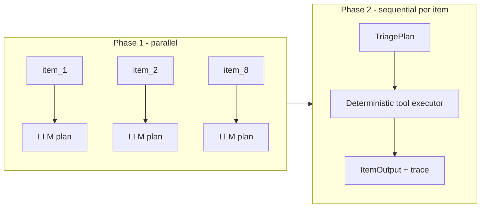

# Origin AI Engineering Take-Home: Referral Inbox Triage Agent

Origin builds software for pediatric therapy practices. In this assignment, you are helping a fictional practice, Cedar Kids Therapy, triage its Monday inbox.

## Scenario

It is Monday at 8am at a multi-disciplinary pediatric therapy practice supporting speech-language pathology, occupational therapy, and physical therapy. The shared inbox accumulated items over the weekend from pediatrician fax referrals, parent voicemails, parent portal messages, and emails. Build an AI agent prototype that turns the messy batch into a sorted, human-reviewable action plan.

## What We Expect

Strong submissions are usually incomplete but honest. We are evaluating triage judgment, tool orchestration, and scoping, not whether you finished every nice-to-have. Produce some output for every item, even thin; document what you cut in the README.

You may use any AI coding agent (Claude Code, Cursor, Codex, etc.) while building. State your stack and assumptions in your README.

Runtime LLM usage is allowed and recommended, but not required. Origin will provide a temporary capped API key for either OpenAI or Anthropic; the email distributing the key will name the provider and the environment variable to set (`OPENAI_API_KEY` or `ANTHROPIC_API_KEY`). You may also use your own provider. You may install dependencies for the provider you choose (e.g., `npm install openai` or `npm install @anthropic-ai/sdk`). Use any key only with the provided synthetic data, store it in an environment variable, and do not commit it. Model choice is not part of the rubric.

## How To Run

```bash
npm install
export ANTHROPIC_API_KEY="your-key-here"
npm run triage
npm run validate
```

Optional flags (defaults shown): `--input data/inbox.json --output output.json --trace .trace/tool-calls.jsonl`.

Typecheck: `npx tsc --noEmit` or `npm run typecheck`.

Reviewers may run the same commands against similar hidden synthetic input. Do not hardcode input, output, or trace paths.

## Share And Submit

Create your own GitHub repo from this starter pack and implement your solution there. The repo can be public or private. When you are done, submit the repo link. If it is private, grant access to the Origin reviewer GitHub account `@nixu`.

Commit your code, your updated `README.md`, and your final generated `output.json`. Do not commit API keys, `.env` files, real PHI, `node_modules/`, or `.trace/`.

We expect you to spend about 2 hours. If you stop before finishing, commit what you have and describe the cuts in your README.

## Stack and Runtime

- **Language / runtime:** TypeScript on Node.js LTS (ES modules via `tsx`)
- **LLM:** Anthropic `@anthropic-ai/sdk` (^0.39.0), model `claude-sonnet-4-20250514`
- **Validation:** `ajv` against `schema/output.schema.json`
- **Assumptions:** Synthetic inbox only; all items require human review (`requires_human_review: true`); agent never auto-sends messages or books appointments

## Architecture

Two-phase pipeline in [`src/agent.ts`](src/agent.ts):



**Phase 1 - parallel LLM planning:** One `messages.create` call per inbox item (all items in parallel). The model returns a JSON `TriagePlan`: classification, urgency, extracted intake, rationale, and an `actions` object describing *which* tools to run-not raw tool results.

**Phase 2 - sequential tool execution:** For each item, `withItemContext(item.id, …)` runs tools in a **fixed order** so downstream steps can depend on earlier results:

1. `lookup_policy` - load practice rules (safeguarding, insurance, cancellation, etc.)
2. `search_patient` - match existing chart before scheduling changes
3. `verify_insurance` - billing status gates whether a slot hold is allowed
4. `find_slots` - surface candidate times for staff review
5. `hold_slot` - only if plan requests it, a slot exists, and insurance is not OON/expired/unknown
6. `create_task` - assign work to intake, billing, front desk, or clinical lead
7. `escalate` - P0/P1 safety or same-day ops
8. `draft_message` - draft-only reply for human review

The LLM is a **planner**, not an executor: it cannot bypass the stub tools or invent `call_id`s. `getToolCallsForItem()` supplies the audit trail the validator checks.

## Failure Modes and Production Eval

| Failure mode | Risk | Mitigation / metrics |
|--------------|------|----------------------|
| **Safeguarding false negative** | Harm disclosure missed → no P0 escalation | Keyword pre-pass + human QA on voicemail/fax; track `safeguarding_recall` on labeled set |
| **LLM JSON parse / schema drift** | Run crashes or invalid output | `normalizePlan()` defaults; production: Zod validate + retry once; metric `plan_parse_success_rate` |
| **Invalid `lookup_policy` topic** | Crash in stub (`snippets.length`) | Validate topic before call; metric `invalid_policy_topic_count` |
| **Insurance state divergence** | Referral says in-network, verify says OON | Executor blocks `hold_slot` when status is OON/expired/unknown; metric `referral_vs_verify_mismatch_rate` |
| **Over-escalation** | P0/P1 noise burns clinical lead | Default P2; track `urgency_distribution` and staff override rate |

**Eval metrics I would track:** validation pass rate, per-classification precision/recall (vs. clinician labels), safeguarding recall, tool-call relevance (manual spot-check), time-to-triage p95, and human override rate on urgency and recommended actions.

## What I Chose Not to Build, and Why

- **Multi-turn agent loop** - Single-shot plan per item is enough for 8 synthetic items within ~2 hours; a ReAct loop adds latency and trace complexity without clear gain on this batch.
- **Attachment parsing** - Referral PDFs are named in metadata only; no OCR/PDF pipeline in scope.
- **Retry on LLM parse failure** - Would improve robustness but was cut for time; `normalizePlan()` handles partial JSON instead.
- **Deterministic safeguarding pre-pass** - Relied on prompt + LLM judgment; a regex/keyword gate before the model would be my first production hardening step.

## What I Would Do With Another 4 Hours

1. **Zod validation** on `TriagePlan` after parse, with structured repair prompt on failure.
2. **Safeguarding keyword pre-pass** (e.g. abuse, neglect, unsafe) to force P0 + `escalate` even if the LLM under-classifies.
3. **Preference-based slot matching** - rank `find_slots` results by stated availability (after school, Spanish, mornings) instead of always holding the first slot.
4. **Eval harness** - golden labels per inbox item, `npm run eval` reporting classification/urgency F1 and trace coverage.

## Your Task

Implement the agent in `src/agent.ts`. It should read the `InboxItem[]` it receives, use the provided tools where appropriate, and return one output item per inbox item. `src/index.ts` wraps your items with `buildBatchOutput()` and writes the final `output.json`.

Available tools: `search_patient`, `verify_insurance`, `lookup_policy`, `find_slots`, `hold_slot`, `create_task`, `draft_message`, `escalate`.

Use `schema/output.schema.json` as the source of truth for the output shape. `data/example_output.json` shows one non-trivial worked item. It is illustrative and is not expected to pass validation by itself. **Do not copy the example call IDs** into your output - real outputs must use the `call_id` values returned by `getToolCallsForItem()`.

## Time Box

Spend about 2 hours. Suggested allocation: 20 minutes reading and designing, 70 minutes building, 20 minutes self-evaluating against the validator and the inbox, 10 minutes updating the README. Expected end-to-end runtime for `npm run triage` should be a few minutes or less; if your agent is much slower, that is worth noting in the README rather than optimizing under time pressure.

Minimum viable submission: processes every item in `data/inbox.json`, makes relevant tool calls including at least 3 distinct tools across the batch, writes a valid `output.json`, and passes `npm run validate`. Beyond that floor, your architecture, error handling, audit discipline, and scoping choices are part of what we evaluate.

## Constraints

- Use TypeScript, Node LTS, and npm. If this creates a real accessibility or environment issue, reach out.
- Use the provided tools in `src/tools.ts`; do not modify, reimplement, or bypass them. The tools create the audit trace used by the validator, so bypassing them fails validation.
- Use at least 3 distinct tools across the batch. Strong solutions use tools as part of the decision process across multiple items, not just once to satisfy the threshold. Irrelevant or performative tool calls will be penalized.
- Use `withItemContext(item.id, async () => ...)` around item-level tool calls.
- Use `getToolCallsForItem(item.id)` for `tools_called[]`; pass the returned entries through unchanged.
- Use `buildBatchOutput(items)` through the starter `src/index.ts`; do not hand-compute summary counts.
- Do not auto-send messages. Use `draft_message` only.
- Do not schedule appointments. `find_slots` and `hold_slot` are reviewable; scheduling is not.
- Use only synthetic data. Do not add real PHI.

## Urgency Calibration

- `P0`: safeguarding, imminent harm, mandated-reporter escalation. Same-hour human review.
- `P1`: same-day operational issue requiring prompt staff action.
- `P2`: normal intake, scheduling, billing, or clinical-review workflow.
- `P3`: low-priority admin, FYI, spam.

Default to `P2` unless there is a clear safety or same-day operational reason. Over-escalation is itself a production failure mode.

## Review Variants

Similar synthetic variants may be run during review. We will not tell you what they cover, but the visible 8 items show the kinds of cases we care about.

## Rubric

- Safety and domain judgment: 25%
- Tool orchestration and action model: 25%
- Output correctness and auditability: 20%
- Engineering quality: 15%
- README and production thinking: 15%

Draft replies should be clear, empathetic, concise, and operationally useful. They must not provide clinical advice or imply messages were sent.
